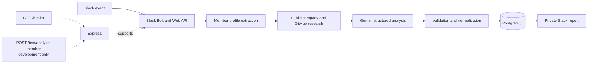

# Community Intelligence Agent

[](https://nodejs.org/)
[](https://expressjs.com/)
[](https://api.slack.com/tools/bolt)
[](https://ai.google.dev/)
[](https://www.postgresql.org/)
[](https://render.com/)

An event-driven Slack AI workflow that researches new community members using public evidence, generates structured fit analysis, stores results in PostgreSQL, and posts actionable onboarding recommendations.

## Project status

The core workflow is complete and deployed on Render as a complementary AI engineering portfolio project. Its analysis is advisory, not an objective assessment, and every result requires human review.

Health endpoint: [community-intelligence-agent.onrender.com/health](https://community-intelligence-agent.onrender.com/health)

The demo uses Render Free Tier infrastructure, so it may cold-start or be temporarily unavailable. Permanent uptime is not guaranteed.

## Demo

**Live Health Endpoint / Current deployment:** [https://community-intelligence-agent.onrender.com/health](https://community-intelligence-agent.onrender.com/health)

**Demo Video**

Coming soon

**Screenshots**

Coming soon

## Problem

Modern communities often receive new members faster than they can manually research and onboard them consistently. Automation can organize available evidence and suggest next steps, but it should not replace human judgment.

## Why I Built This

I built this project to explore event-driven AI workflows in a practical backend setting.
It combines Slack automation with lightweight public research and external API orchestration.
The implementation emphasizes structured LLM outputs that application code can validate and persist.
It also demonstrates backend AI orchestration without introducing unnecessary infrastructure.

## Solution

The agent receives Slack membership events, retrieves the available member profile, performs lightweight public research, sends structured context to Gemini, validates and normalizes the response, persists it in PostgreSQL, and posts a concise report to a private Slack channel.

## Architecture



## Architecture Principles

- Event-driven architecture
- Human-in-the-loop decisions
- Evidence-aware AI outputs
- Lightweight backend design
- Responsible automation

## Workflow

1. Slack Bolt listens for `team_join` and `member_joined_channel` events through Socket Mode.
2. The Slack Web API retrieves the member's available name, email, title, timezone, and profile fields.
3. The agent performs lightweight research against a public company website and GitHub user search.
4. Name-based GitHub results are explicitly treated as possible, unverified identity matches.
5. Gemini receives only the supplied Slack profile and research context and returns the structured analysis contract.
6. A manual validator extracts JSON, validates required fields, normalizes numeric scores, and derives the overall score.
7. PostgreSQL stores the structured analysis, legacy-compatible fields, research data, and analysis status.
8. A formatted report is posted to the configured private Slack channel.
9. The saved row is marked with its sent-to-Slack status and timestamp.

## Key features

- Event-driven Slack workflow using `team_join` and `member_joined_channel`
- Slack Socket Mode and Slack Web API integration
- Lightweight public company and GitHub enrichment
- Gemini-powered structured analysis
- Four category scores plus a derived overall score
- Evidence-aware confidence reporting
- Separate evidence, inference, and missing-information fields
- PostgreSQL and JSONB persistence
- Formatted private-channel Slack reports
- Safe structured failure states without fabricated scores
- Development-only test endpoint
- HTTP health endpoint
- Focused tests using Node's native test runner
- Render deployment configuration

## Structured analysis contract

The application-level response contains:

- `status`: `completed`, `incomplete`, or `failed`
- `categoryScores`: technical relevance, community alignment, contribution potential, and product fit
- `overallScore`: derived from available category scores
- `confidence`: evidence-completeness rating
- `evidence`: sourced claims marked `confirmed` or `possible_match`
- `inferences`: model interpretations kept separate from evidence
- `missingInformation`: facts unavailable from the supplied context
- `recommendations`: concise onboarding suggestions
- `manualReviewRequired`: explicit human-review requirement

```json
{
  "status": "completed",
  "categoryScores": {
    "technicalRelevance": 78,
    "communityAlignment": 72,
    "contributionPotential": 76,
    "productFit": 70
  },
  "overallScore": 74,
  "confidence": "medium",
  "evidence": [
    {
      "claim": "Public company website was available",
      "source": "https://example.org",
      "type": "confirmed"
    }
  ],
  "inferences": ["The member may benefit from a technical onboarding path."],
  "missingInformation": ["No verified GitHub profile was supplied."],
  "recommendations": ["Ask about current community goals."],
  "manualReviewRequired": true
}
```

A failed analysis has `null` category and overall scores, `confidence: "none"`, and mandatory manual review. It never falls back to a fabricated `50/100` score.

## Example Slack output

```text
|-- index.js              # Application entry point and workflow orchestration
|-- analysis.js           # AI response validation and score normalization
|-- slack-format.js       # Private-channel report formatting
|-- db.js                 # PostgreSQL schema and persistence operations
|-- analysis.test.js      # Focused contract and formatting tests
|-- .env.example          # Safe local environment template
|-- render.yaml           # Render service and database Blueprint
`-- package.json          # Project scripts and runtime dependencies
- Technical relevance: 78/100
- Community alignment: 72/100
- Contribution potential: 76/100
- Product fit: 70/100

Confirmed/public evidence:
- Public company website was available - https://example.org

Possible matches (identity unverified):
- A name-based GitHub result may be relevant - https://github.com/example

Model inferences:
- The member may benefit from a technical onboarding path.

Missing information:
- No verified GitHub profile was supplied.

Recommendations:
- Ask about current community goals.
```

> Future screenshot placeholder: `docs/screenshots/member-analysis.png` - no screenshot is currently included.

## Technology stack

- Node.js and JavaScript ES modules
- Express
- Slack Bolt and Slack Web API
- LangChain with Google Gemini
- PostgreSQL
- Axios
- Node native test runner
- Render

## Repository structure

```text
.
|-- index.js              # Application entry point and workflow orchestration
|-- analysis.js           # AI response validation and score normalization
|-- slack-format.js       # Private-channel report formatting
|-- db.js                 # PostgreSQL schema and persistence operations
|-- analysis.test.js      # Focused contract and formatting tests
|-- .env.example          # Safe local environment template
|-- render.yaml           # Render service and database Blueprint
`-- package.json          # Project scripts and runtime dependencies
```

## Local setup

Requirements: Node.js 20 or newer, PostgreSQL, a configured Slack app, and a Gemini API key.

```bash
npm install
```

Copy `.env.example` to `.env` and populate the required values. On Windows PowerShell:

```powershell
Copy-Item .env.example .env
```

On macOS or Linux:

```bash
cp .env.example .env
```

Start the application and run its tests:

```bash
npm start
npm test
```

Set `NODE_ENV=development` to enable `POST /test/analyze-member`. The route is not registered in production.

## Environment variables

| Variable | Required | Secret | Purpose |
| --- | --- | --- | --- |
| `NODE_ENV` | Yes | No | Runtime mode; use `development` locally and `production` on Render. |
| `PORT` | No | No | Express port; defaults to `3000` locally and uses Render's supplied value when deployed. |
| `SLACK_BOT_TOKEN` | Yes | Yes | Slack bot token used by Bolt and the Web API. |
| `SLACK_SIGNING_SECRET` | Yes | Yes | Verifies Slack application requests and configures Bolt. |
| `SLACK_APP_TOKEN` | Yes | Yes | App-level token used for Socket Mode. |
| `SLACK_PRIVATE_CHANNEL_ID` | Yes | No | Destination channel ID for analysis reports. |
| `GEMINI_API_KEY` | Yes | Yes | Authenticates Gemini API requests. |
| `GEMINI_MODEL` | Yes | No | Gemini model identifier, currently configured as `gemini-3-flash-preview` on Render. |
| `DATABASE_URL` | Yes | Yes | PostgreSQL connection string. |
| `COMPANY_NAME` | No | No | Company context supplied to the analysis prompt. |
| `COMPANY_PRODUCT` | No | No | Product context supplied to the analysis prompt. |

Never commit `.env` or real credentials.

## Testing

```bash
npm test
```

The focused unit suite covers:

- Valid structured Gemini output normalization
- Malformed-output failure fallback
- Out-of-range and invalid category scores
- Failed Slack formatting with `Not available` instead of `50/100`
- Clear labelling of unverified GitHub matches

The repository does not currently include external integration tests; unit tests do not call Slack, Gemini, GitHub, company websites, or PostgreSQL.

## Deployment

The Render Blueprint defines a Node web service and PostgreSQL resource. Render runs `npm install`, starts the service with `npm start`, supplies environment variables, and checks `GET /health`.

Free Tier services can cold-start after inactivity, and free PostgreSQL resources have expiration and persistence limitations. A paid database is more appropriate for continuous or long-term use.

## Reliability and failure handling

- Invalid or malformed AI output becomes a structured failed result.
- Failed analysis never receives an invented score.
- Individual public-research failures return no result and do not crash the research workflow.
- Database initialization must succeed before Express and Slack start because persistence is required.
- Slack and processing failures are logged with concise error messages.
- The product-fit result remains advisory and requires human review.

## Responsible use

- Use only public information or data voluntarily supplied by the member.
- Do not infer protected characteristics.
- Name-based GitHub results are labelled as possible matches with unverified identity.
- Scores organize limited evidence; they are not objective truth.
- Do not use this system to make automatic hiring, access, financial, eligibility, or other sensitive decisions.
- A person must review every analysis before acting on it.

## Tutorial attribution

The initial implementation was developed while following a public YouTube tutorial. I extended the baseline with Gemini integration, validated structured outputs, evidence-aware confidence reporting, normalized PostgreSQL persistence, responsible-use safeguards, graceful failure states, deployment improvements, and focused tests.

Tutorial link: [Add tutorial URL]

## Personal improvements

- Replaced the baseline OpenAI integration with Gemini
- Added structured category scoring and derived overall scores
- Separated sourced evidence from model inference
- Added confidence and missing-information reporting
- Introduced a safe failed-analysis state with null scores
- Added normalized structured JSONB persistence and analysis status
- Labelled name-based identity results as unverified
- Added focused unit tests
- Added Render deployment configuration
- Produced professional project documentation

## Engineering Takeaways

- Slack events and Socket Mode enable compact event-driven workflows.
- Event handlers should hand work to clear orchestration steps and handle external failures explicitly.
- External API results need provenance and identity caveats.
- Structured LLM output still requires deterministic validation.
- AI scoring needs clear limits, missing-information reporting, and human review.
- PostgreSQL JSONB can preserve evolving structured output while legacy columns maintain compatibility.
- Deployment troubleshooting depends on startup ordering, environment configuration, and dependency availability.

## Portfolio Focus

- Event-driven backend engineering
- Slack API integration
- AI workflow orchestration
- Structured LLM outputs
- PostgreSQL persistence
- Responsible AI engineering

## Future improvements

- Accept optional verified GitHub URLs or usernames.
- Add limited retry and backoff for temporary external failures.
- Add focused integration tests around mocked service boundaries.
- Move from the preview Gemini model when an appropriate stable model is selected.
- Move from Free Tier infrastructure for persistent use.

## License

No repository license file is currently included. The package metadata says `ISC`, but repository licensing should be chosen explicitly before reuse or distribution.
