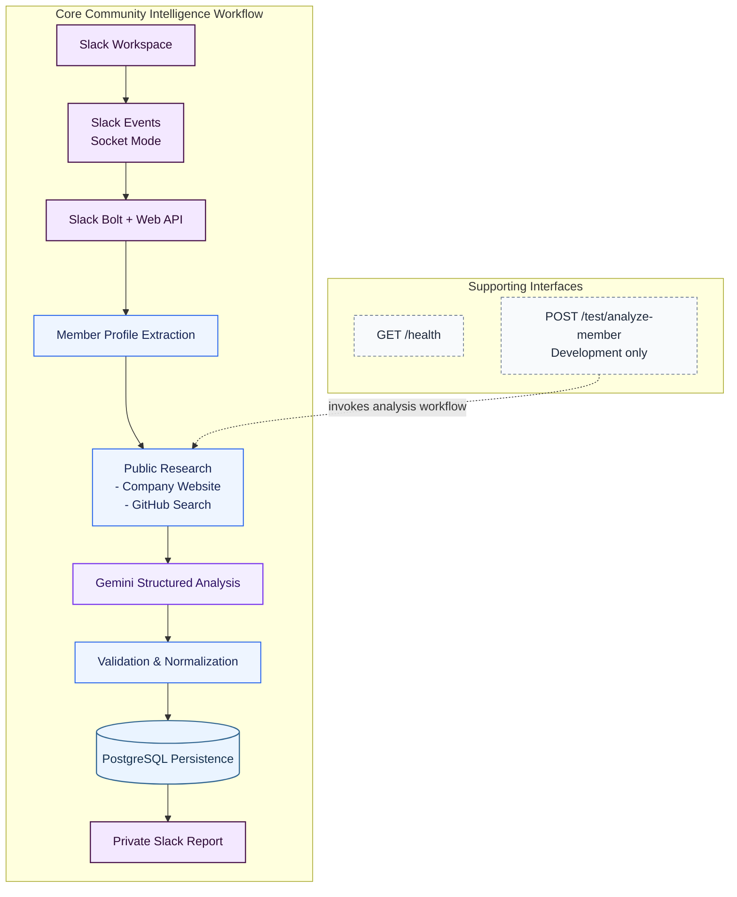

# Community Intelligence Agent Architecture

This document accompanies the reusable [Mermaid source](./architecture.mmd). The diagram follows the implemented Slack-to-analysis workflow and keeps HTTP support routes separate from the main pipeline.

## 1. Overall workflow

Slack membership events arrive through Socket Mode. Slack Bolt and the Web API retrieve the member profile, after which the agent performs lightweight public research. Gemini produces a structured analysis that is validated, normalized, saved to PostgreSQL, and then formatted for a private Slack channel.

The Express health route and development-only analysis route are supporting interfaces rather than steps in the normal Slack event path.

## 2. Component responsibilities

- **Slack Workspace and events:** Produce `team_join` and `member_joined_channel` events.
- **Slack Bolt and Web API:** Receive Socket Mode events, retrieve profiles, and post reports.
- **Member Profile Extraction:** Select the available identity and professional profile fields used by the workflow.
- **Public Research:** Checks a public company website and performs a name-based GitHub search. GitHub results remain unverified possible matches.
- **Gemini Structured Analysis:** Produces evidence, inferences, missing information, recommendations, confidence, and category scores.
- **Validation and Normalization:** Enforces the application contract, derives the overall score, and creates safe failed results for malformed output.
- **PostgreSQL Persistence:** Stores member context, research data, analysis status, structured JSON, and Slack delivery state.
- **Private Slack Report:** Presents the validated result for human review.
- **Supporting Interfaces:** `GET /health` reports process health; `POST /test/analyze-member` invokes the workflow only in development.

## 3. Why validation follows Gemini

LLM output is not trusted as application data until it has been parsed and checked. Validation rejects missing fields and invalid types, normalizes numeric scores, derives the overall score consistently, and prevents malformed responses from reaching storage or Slack as successful analyses.

## 4. Why persistence precedes Slack reporting

The workflow saves the analysis before attempting delivery so there is an audit record even if Slack posting fails. After a successful post, the same row is updated with `sent_to_slack` and its delivery timestamp. This ordering distinguishes saved-but-unsent results from fully delivered analyses.

## 5. Failure handling

Public research failures are handled without crashing the analysis. Gemini provider or parsing failures become structured failed results with null scores, no fabricated fallback score, and required manual review. Database initialization failure prevents startup because persistence is required. Slack posting failures are logged, while an already saved row remains marked as unsent.

## 6. Human review requirement

The analysis is advisory. Evidence can be incomplete, GitHub identity matches can be uncertain, and category scores are not objective truth. A person must review the evidence, inferences, missing information, and recommendations before taking action; the workflow must not make automated sensitive decisions.

[Back to the project README](../../README.md)
